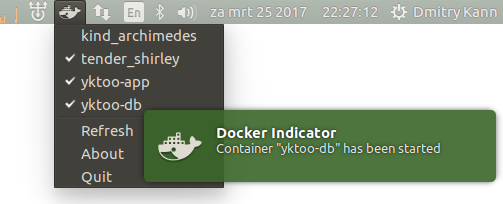

Docker Indicator
================

A very basic implementation of Ubuntu/Unity application indicator for controlling [Docker](https://www.docker.com/) containers.



Available functionality
-----------------------

* Displaying a live list of available containers (both running and stopped). The list is updated automatically thanks to Docker daemon event subscription.
* Starting and stopping a container by selecting the corresponding menu item.
* Displaying a desktop notification whenever a container is started or stopped (not necessarily via the indicator).


Requirements
------------

* Python 3
* gir1.2-appindicator3-0.1
* gettext
* docker (`sudo pip install docker`)


How to run
----------

Sorry folks, no installer available yet. To run the app:

1. Copy app icons:
    ```bash
    sudo cp ./icons/default/indicator-docker.svg /usr/share/icons/hicolor/22x22/status/
    sudo cp ./icons/ubuntu-mono-dark/indicator-docker.svg /usr/share/icons/ubuntu-mono-dark/status/22/
    sudo cp ./icons/ubuntu-mono-light/indicator-docker.svg /usr/share/icons/ubuntu-mono-light/status/22/
    ```
2. Update icon cache:
    ```bash
    sudo update-icon-caches /usr/share/icons/*
    ```
3. Run the app prefixing its name with the path to its `lib` dir:
    ```bash
    PYTHONPATH=lib ./indicator-docker
    ```

Bug Reporting
-------------

Run the application in verbose mode to see the detailed log:

    indicator-docker -vv

and, once the error condition has been reproduced, attach the output to the report.

